# baca_buku_flutter

Nama Kelompok : Bismilah  
Anggota Kelompok :  

1. Nurul Huda  
2. Putri Novika Arini  
3. Ratu Veronica E. I.  

## Judul Aplikasi : Baca Buku

## Desain Mockup
Link : https://www.figma.com/file/AAL42KbD9YQ8oXM2wYKgMA/Untitled?node-id=0%3A1

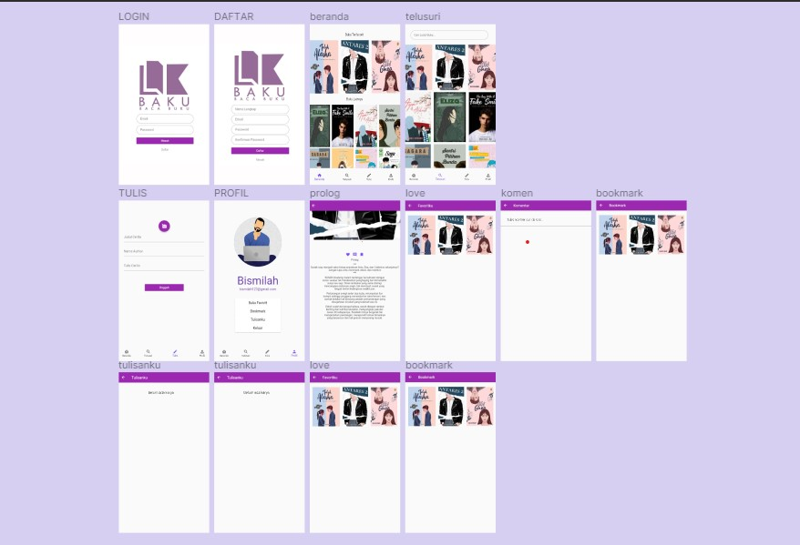

## Hasil
### Halaman login (Ratu Veronica)
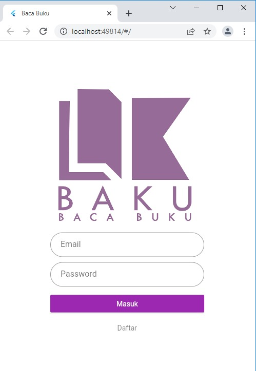
### Halaman register (Ratu Veronica)
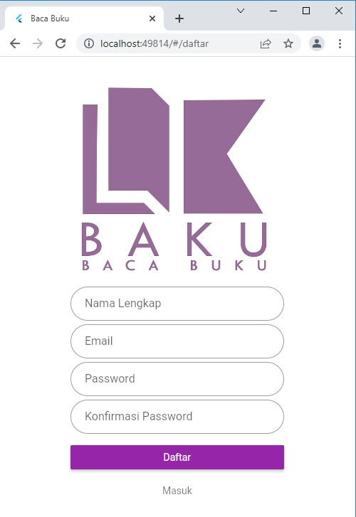
### Halaman beranda (Nurul Huda)
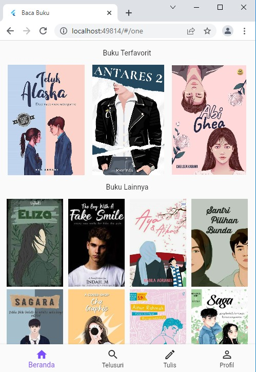
### Halaman telusuri (Ratu Veronica)
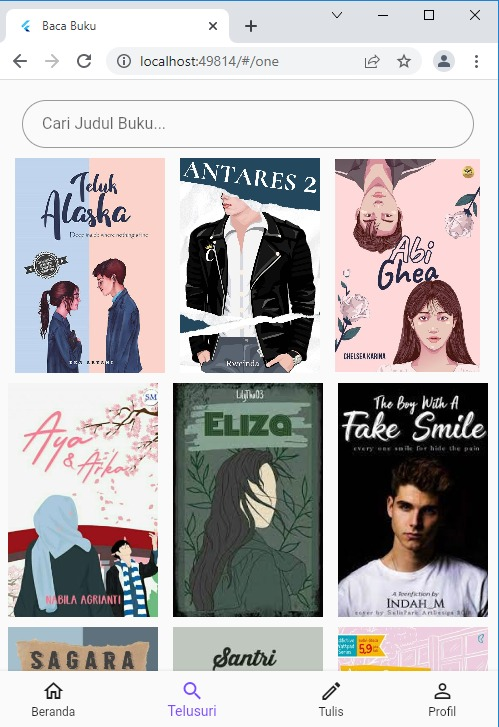
### Halaman tulis (Putri Novika)
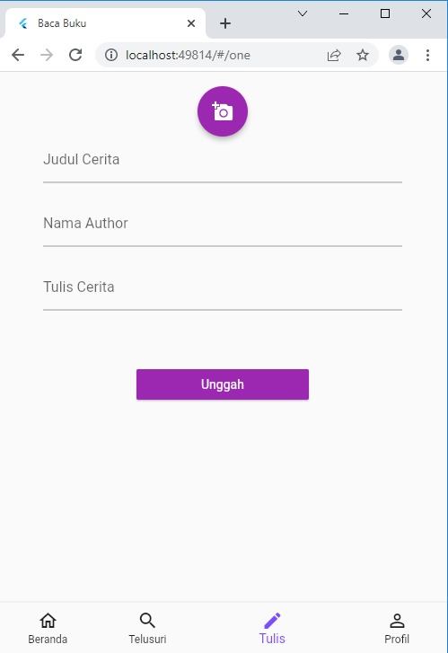
### Halaman profil (Putri Novika)
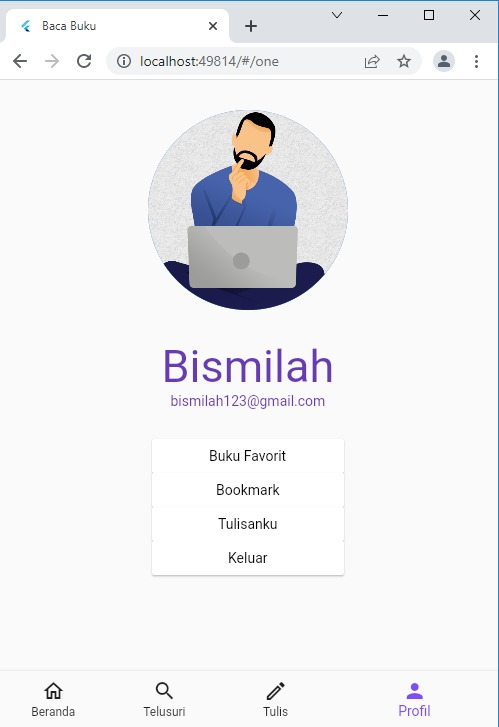
### Halaman detail novel (Nurul Huda)
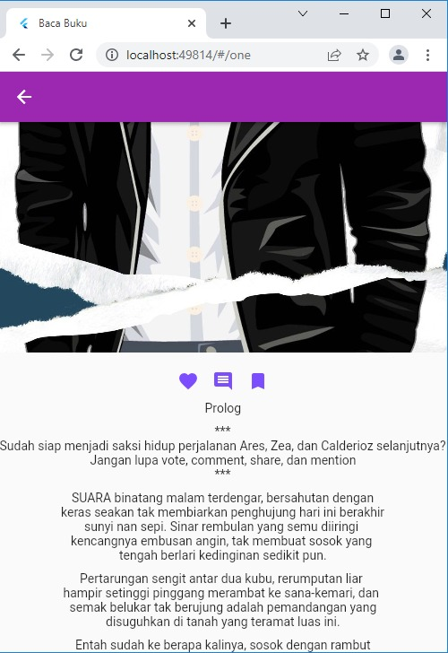
### Halaman favoritku (Nurul Huda)
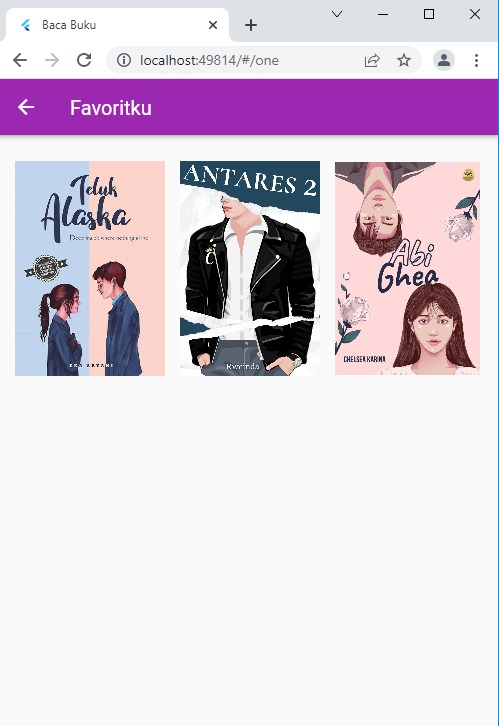
### Halaman komentar (Putri Novika)
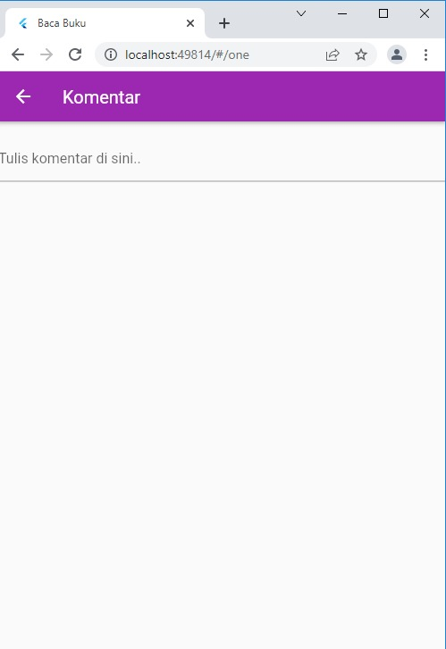
### Halaman bookmark (Nurul  Huda)
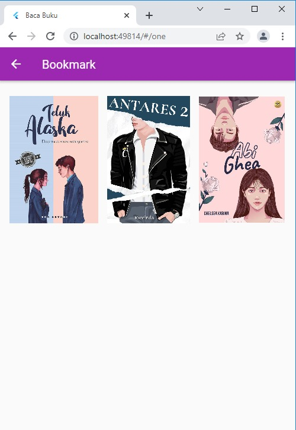
### Halaman tulisanku (Putri Novika)

### HASIL
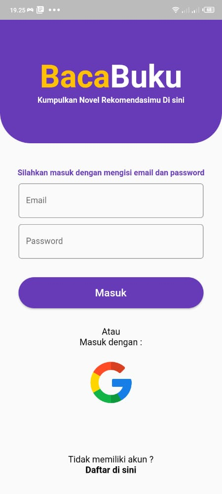